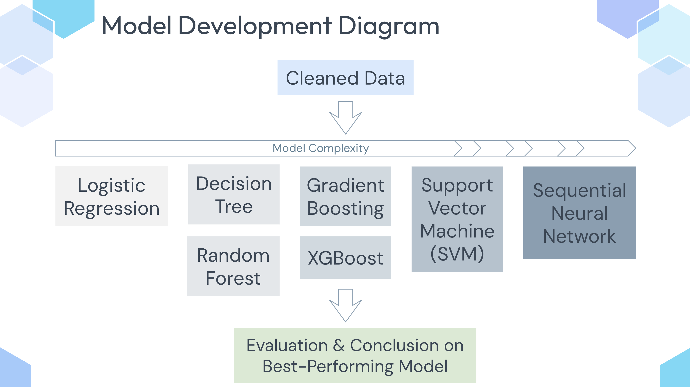

# Instagram Fake Account Detection with Machine Learning

## Abstract 
The rise of social media platforms like Instagram has led to an increase in fake accounts, distorting engagement metrics and spreading misinformation. This project develops a machine learning model to classify Instagram accounts as genuine or spam, improving online interaction reliability and social media analytics. We tested various models, including Logistic Regression, Random Forest, XGBoost, and Sequential Neural Networks. XGBoost performed best with 94% accuracy, followed by Random Forest at 92.5%, which offered strong interpretability. The Sequential Neural Network showed potential at 89%, while Logistic Regression provided insights with 92% accuracy. Random Forest demonstrated stability with bootstrapping, achieving 91%-92% accuracy. Key features for distinguishing fake and genuine accounts included follower count, post count, and username characteristics. Despite a small dataset, this work establishes a solid foundation for scalable spam detection, with future improvements focusing on additional features and larger datasets.

## Table of Contents
- [Introduction](#introduction)
- [Dataset](#dataset)
- [Setup](#setup)
- [Evaluation](#evaluation)
- [Results](#results)
- [Discussion](#discussion)
- [Conclusion](#conclusion)
- [How to Run](#how-to-run)

## Introduction
Social media platforms like Instagram face the issue of fake and spam accounts, which distort engagement metrics, mislead users, and spread misinformation. This project aims to develop a machine learning model to classify Instagram accounts as genuine or spam using features like followers count, post frequency, and account details. The goal is to improve the reliability of social media interactions and engagement metrics, fostering trust in the platform.

Fake accounts are a problem across industries, particularly in marketing, where they can distort target audience data and waste advertising budgets. By applying machine learning, this project addresses these challenges and provides businesses with more accurate data for decision-making.

We used models like Random Forest, XGBoost, and Sequential Neural Networks, each chosen for their ability to capture complex patterns. Random Forest provides interpretability, XGBoost delivers high accuracy, and Sequential Neural Networks model non-linear patterns. This multi-model approach allows us to compare performance and identify the best model for the task.

Our approach differs from traditional methods by adapting to new data patterns, improving classification over time. While Random Forest and XGBoost performed best, future work will focus on expanding the dataset and incorporating more features for better scalability and robustness.

## Dataset 
The dataset used in this project contains 696 Instagram accounts with various features such as:

- Number of followers
- Number of posts
- Profile picture status
- Username characteristics, etc.

The data is divided into 50% fake and 50% real accounts, providing a balanced dataset to build and evaluate our models.

## Setup

The project explored various machine learning models, focusing on the best-performing models for detecting Instagram fake accounts. We tested Logistic Regression (LR), Tree-based models like Decision Trees and Random Forests, and advanced techniques like Gradient Boosting, XGBoost, Support Vector Machines (SVM), and Sequential Neural Networks (RNN).

### **Regression-based Models: Logistic Regression** (baseline)
We used default settings for LR as the baseline and fine-tuned the model with L1, L2, and Elastic Net regularizations using randomized search with 5-fold cross-validation. Only the best-performing LR model was included in the final evaluation.

### **Tree-based Models: Decision Tree and Random Forest** (with Grid Search for hyperparameter tuning)
Decision Trees and Random Forest models were initialized with default settings. For tree pruning, Decision Trees were tuned using randomized search CV with 5-fold and cost complexity pruning, while Random Forests used both grid search CV and randomized search CV for hyperparameter tuning. Random Forests showed competitive performance and were included in the final model evaluation.

### **Boosting-based Models: Gradient Boosting and XGBoost** (with Random Search for hyperparameter tuning)
Both Gradient Boosting and XGBoost models were set with default settings. Hyperparameters were fine-tuned using a 3-fold grid search and randomized search CV, leading to competitive results. XGBoost performed well in terms of accuracy but didn't provide as clear insights into feature importance as Random Forest.

### **Advanced Non-linear Models: SVM and Sequential Neural Network** (designed for complex data patterns)
For SVM and Sequential Neural Networks, the baseline configurations were used with tuning of hyperparameters such as regularization (L2), dropout, and learning rates. These models demonstrated potential for capturing non-linear patterns but were not the best-performing models.

### Key Techniques:
- **Feature Engineering**: Focused on features such as followers count, posts count, and username length.
- **Hyperparameter Tuning**: Both Grid Search and Random Search are employed for tuning the models.
- **Cross-validation**: Used to ensure model robustness and prevent overfitting.

## Evaluation
The models are evaluated using the following metrics:

- **Accuracy**: Measures the overall performance.
- **Precision**: Helps minimize false positives, which is crucial in preventing unnecessary misclassification.
- **ROC-AUC**: Assesses the model's ability to distinguish between fake and genuine accounts across different decision thresholds.

Additionally, **Bootstrapping** is used to evaluate the model’s stability and generalization across different subsets of the data.

## Results

### Main Results 
- **Random Forest**: Followed closely with an accuracy of 92.5%, offering superior interpretability with clear feature importance (see the plot in google colab) .demonstrated superior interpretability and feature importance while maintaining competitive performance in terms of accuracy and precision.
- **XGBoost**: Achieved the highest accuracy of 94% but did not provide as clear feature insights as Random Forest.
- **Sequential Neural Network**: Performed well in capturing non-linear patterns but showed slightly lower accuracy compared to Random Forest and XGBoost, with an accuracy of 89%.
- **Logistic Regression**: Performed at 92% accuracy, offering useful insights but lagging behind in precision and ROC-AUC performance compared to other models.
### Model Comparison in Detail
- The Random Forest model showed a strong balance between accuracy and interpretability. The confusion matrix revealed 4 false positives and 6 false negatives, suggesting accurate predictions for distinguishing fake from real accounts.
- Bootstrapping results: accuracy ranged from 91%-92%, with a low standard deviation of 1.36%, indicating the model's stability and generalizability across different data subsets.
- Performance of Sequential Neural Network: the Sequential Neural Network demonstrated good performance with no significant overfitting as evidenced by the training and validation loss curves. Model accuracy reached nearly 90%, with a small gap between the training and validation loss, suggesting minimal overfitting and efficient learning.

### Supplementary Results - Parameter Choices

XGBoost and Random Forest: Tuned using Random Search (XGBoost) and Grid Search (Random Forest) to optimize hyperparameters, including:
- Learning rate
- Number of estimators
- Maximum depth
- Subsample rate

Sequential Neural Network:
- Batch size: 50
- Epochs: 64
- Optimizer: Adam, with early stopping to prevent overfitting

Feature Engineering: focused on the following key attributes to enhance model performance:
- Follower count
- Post count
- Profile picture presence
- Username length

## Discussion
We focused on Random Forest and Sequential Neural Networks not only for their strong performance but also for the insights they provide. Random Forest helps us understand which features distinguish fake from real accounts, while the Sequential Neural Network can model deeper, non-linear relationships, making it suitable for more complex data in the future. These models offer a strong foundation for future improvements, despite the current dataset's size limitations.
Comparing our results with existing approaches, which report accuracies in the range of 85-95% for spam detection, our models align well or slightly outperform many baseline results. Factors like balanced data, effective feature engineering (such as profile picture presence and username characteristics), and robust hyperparameter tuning contributed to these outcomes.
However, some limitations were observed:
- Feature Availability: The dataset relied on a finite set of features, some of which (e.g., description length and followers) might not fully capture the nuanced behavior of spam accounts.
- Dataset Size: The relatively small dataset (696 samples) may restrict the generalizability of the model to larger-scale, real-world datasets.

Future work could include incorporating additional behavioral features (e.g., interaction patterns) and testing the models on larger datasets to validate their scalability and robustness.

## Conclusion
We developed a machine learning pipeline to classify Instagram accounts as fake or genuine, testing models from Logistic Regression to Neural Networks. The Random Forest model stood out, balancing accuracy, precision, and interpretability. Key features like follower count, post count, and username characteristics proved crucial in distinguishing genuine accounts. This work supports safer online communities by offering a scalable spam detection framework, with future improvements targeting larger datasets and enhanced feature sets.

## How to Run
Open the notebook in Google Colab by clicking on the link below: 
`https://colab.research.google.com/drive/1kHsFbrw1QHFBs1iPIuib-JHoMj-zTICL#scrollTo=y8HChLvRVf6A`

### Instructions to Use:
1.  `https://github.com/laurieye/Detection-of-Fake-Spammer-and-Genuine-Accounts-on-Instagram`
2.  Google Colab: `https://colab.research.google.com/drive/1kHsFbrw1QHFBs1iPIuib-JHoMj-zTICL#scrollTo=y8HChLvRVf6A`

### Open Colab Notebook

Follow the instructions in the Colab notebook to load the dataset, train the models, and evaluate them based on the provided metrics.
