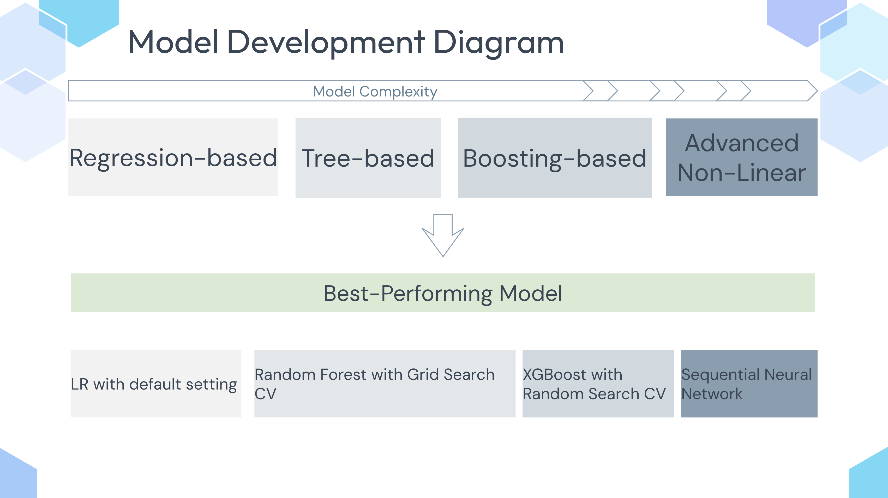

# Instagram Fake Account Detection with Machine Learning

## Abstract 
The rise of social media platforms like Instagram has led to an increase in fake accounts, distorting engagement metrics and spreading misinformation. This project develops a machine learning model to classify Instagram accounts as genuine or spam, improving online interaction reliability and social media analytics. We tested various models, including Logistic Regression, Random Forest, XGBoost, and Sequential Neural Networks. XGBoost performed best with 94% accuracy, followed by Random Forest at 92.5%, which offered strong interpretability. The Sequential Neural Network showed potential at 89%, while Logistic Regression provided insights with 92% accuracy. Random Forest demonstrated stability with bootstrapping, achieving 91%-92% accuracy. Key features for distinguishing fake and genuine accounts included follower count, post count, and username characteristics. Despite a small dataset, this work establishes a solid foundation for scalable spam detection, with future improvements focusing on additional features and larger datasets.

## Table of Contents
- [Introduction](#introduction)
- [Dataset](#dataset)
- [Setup](#setup)
- [Evaluation](#evaluation)
- [Results](#results)
- [Discussion](#discussion)
- [Conclusion](#conclusion)
- [How to Run](#how-to-run)

## Introduction
Social media platforms like Instagram face the issue of fake and spam accounts, which distort engagement metrics, mislead users, and spread misinformation. This project aims to develop a machine learning model to classify Instagram accounts as genuine or spam using features like followers count, post frequency, and account details. The goal is to improve the reliability of social media interactions and engagement metrics, fostering trust in the platform.

Fake accounts are a problem across industries, particularly in marketing, where they can distort target audience data and waste advertising budgets. By applying machine learning, this project addresses these challenges and provides businesses with more accurate data for decision-making.

We used models like Random Forest, XGBoost, and Sequential Neural Networks, each chosen for their ability to capture complex patterns. Random Forest provides interpretability, XGBoost delivers high accuracy, and Sequential Neural Networks model non-linear patterns. This multi-model approach allows us to compare performance and identify the best model for the task.

Our approach differs from traditional methods by adapting to new data patterns, improving classification over time. While Random Forest and XGBoost performed best, future work will focus on expanding the dataset and incorporating more features for better scalability and robustness.

## Dataset 
The dataset used in this project contains 696 Instagram accounts with various features such as:

- Number of followers
- Number of posts
- Profile picture status
- Username characteristics, etc.

The data is divided into 50% fake and 50% real accounts, providing a balanced dataset to build and evaluate our models.

## Setup

The project explored various machine learning models, focusing on the best-performing models for detecting Instagram fake accounts. We tested Logistic Regression (LR), Tree-based models like Decision Trees and Random Forests, and advanced techniques like Gradient Boosting, XGBoost, Support Vector Machines (SVM), and Sequential Neural Networks (RNN).

### Experimental Setup
In our experiments, we implemented and tested several machine learning models to classify Instagram accounts as either fake or genuine. The models tested included:

- Logistic Regression (baseline model)
- Tree-based Models: Decision Tree and Random Forest
- Boosting-based Models: Gradient Boosting and XGBoost
- Advanced Non-Linear Models: Support Vector Machine (SVM) and Sequential Neural Network (RNN)

For each model, we employed cross-validation and used different hyperparameter tuning strategies such as Grid Search and Random Search to find the optimal parameters (Hyperparameter Tuning):

- Logistic Regression: Fine-tuned using L1, L2, and Elastic Net regularizations via randomized search with 5-fold cross-validation.
- Tree-based Models (Decision Trees and Random Forest): Tuned using randomized search and grid search with 5-fold cross-validation.
- Gradient Boosting and XGBoost: Fine-tuned using 3-fold grid search and randomized search CV.
- Sequential Neural Network: Tuned using a batch size of 50 and 64 epochs, with Adam optimizer and early stopping to prevent overfitting.

#### Computing Environment
The models were executed in Google Colab for ease of use, access to GPU acceleration, and integration with Python libraries such as scikit-learn, XGBoost, and TensorFlow for building the models.

- Hardware: Google Colab's GPU was used for training the models, especially for the Sequential Neural Network.
- Software: The primary libraries used were:
scikit-learn for traditional machine learning models (Logistic Regression, Decision Trees, Random Forests, SVM)
XGBoost for the boosting-based models
TensorFlow (via Keras) for the Sequential Neural Network

#### Problem Setup
The goal of this project was to classify Instagram accounts into two categories: genuine or fake. This is a binary classification problem, where the machine learning models predict whether an account is fake based on several input features.

For the Sequential Neural Network (Network Structure):

- Input Layer: Accepts features such as followers count, post count, profile picture presence, and username length.
- Hidden Layers: Two hidden layers with 64 units and 32 units, respectively, using ReLU activation and L2 regularization.
- Output Layer: A sigmoid activation to predict a probability between 0 and 1, indicating whether the account is fake or genuine.
- This setup helps capture non-linear relationships in the data and classify Instagram accounts based on complex patterns.

## Evaluation
The models are evaluated using the following metrics:

- **Accuracy**: Measures the overall performance.
- **Precision**: Helps minimize false positives, which is crucial in preventing unnecessary misclassification.
- **ROC-AUC**: Assesses the model's ability to distinguish between fake and genuine accounts across different decision thresholds.

Additionally, **Bootstrapping** is used to evaluate the model’s stability and generalization across different subsets of the data.

## Results

### Main Results 
- **Random Forest**: Achieved an accuracy of 92.5%, providing a strong balance between accuracy and interpretability. The model demonstrated superior feature importance (shown in the plot in Google Colab), helping to understand which features were most influential in classifying accounts as fake or genuine. The confusion matrix revealed 4 false positives and 6 false negatives, suggesting accurate predictions in distinguishing between fake and real accounts.
- **XGBoost**: Achieved the highest accuracy at 94%, demonstrating superior performance in terms of overall accuracy. However, it did not offer as clear feature importance insights as Random Forest, which makes it less interpretable. 
- **Sequential Neural Network**: Showed promising results in capturing non-linear patterns, but underperformed compared to Random Forest and XGBoost, with an accuracy of 89%. Despite this, it performed well in model learning, with minimal overfitting, as evidenced by the training and validation loss curves, which remained close throughout the training process.
- **Logistic Regression**:  Performed at 92% accuracy, providing useful insights for baseline comparison. However, it lagged behind the other models in precision and ROC-AUC. Its simplicity made it a solid foundation for understanding the problem, but more complex models like Random Forest and XGBoost provided better results.
### Model Comparison in Detail
- Random Forest showed a good balance between accuracy and interpretability. Bootstrapping results showed accuracy between 91%-92%, with a low standard deviation of 1.36%, indicating strong stability and generalization across different subsets of the data.
- Sequential Neural Network: Demonstrated minimal overfitting, with training and validation loss curves showing small gaps, suggesting efficient learning from the data. The model’s accuracy reached almost 90%, demonstrating its potential, but it still did not match the performance of the other two models.

### Supplementary Results 

#### Parameter Choices:
- XGBoost and Random Forest were both fine-tuned using Grid Search (Random Forest) and Random Search (XGBoost) for hyperparameter optimization. Key parameters like learning rate, number of estimators, tree depth, and subsample rate were adjusted to achieve the best performance.
- The Sequential Neural Network utilized a batch size of 50 and 64 epochs. The Adam optimizer was employed to adjust the learning rate, and early stopping was applied to prevent overfitting during training.

#### Feature Engineering:
- Key features such as follower count, post count, profile picture presence, and username length were identified and utilized as essential predictors for distinguishing fake accounts from genuine ones. These features had a significant impact on model performance, enabling better classification of Instagram accounts.

#### Model Performance:
The performance of Random Forest and XGBoost was competitive in terms of accuracy and precision, with Random Forest standing out due to its interpretability. Sequential Neural Networks were chosen for their ability to capture non-linear relationships but showed slightly lower accuracy compared to the tree-based models. However, they remain valuable for tasks that involve more complex and high-dimensional data.

## Discussion
We focused on Random Forest and Sequential Neural Networks not only for their strong performance but also for the insights they provide. Random Forest helps us understand which features distinguish fake from real accounts, while the Sequential Neural Network can model deeper, non-linear relationships, making it suitable for more complex data in the future. These models offer a strong foundation for future improvements, despite the current dataset's size limitations.
Comparing our results with existing approaches, which report accuracies in the range of 85-95% for spam detection, our models align well or slightly outperform many baseline results. Factors like balanced data, effective feature engineering (such as profile picture presence and username characteristics), and robust hyperparameter tuning contributed to these outcomes.
However, some limitations were observed:
- Feature Availability: The dataset relied on a finite set of features, some of which (e.g., description length and followers) might not fully capture the nuanced behavior of spam accounts.
- Dataset Size: The relatively small dataset (696 samples) may restrict the generalizability of the model to larger-scale, real-world datasets.

Future work could include incorporating additional behavioral features (e.g., interaction patterns) and testing the models on larger datasets to validate their scalability and robustness.

## Conclusion
We developed a machine learning pipeline to classify Instagram accounts as fake or genuine, testing models from Logistic Regression to Neural Networks. The Random Forest model stood out, balancing accuracy, precision, and interpretability. Key features like follower count, post count, and username characteristics proved crucial in distinguishing genuine accounts. This work supports safer online communities by offering a scalable spam detection framework, with future improvements targeting larger datasets and enhanced feature sets.

## How to Run
Open the notebook in Google Colab by clicking on the link below: 
`https://colab.research.google.com/drive/1kHsFbrw1QHFBs1iPIuib-JHoMj-zTICL#scrollTo=y8HChLvRVf6A`

### Instructions to Use:
1.  `https://github.com/laurieye/Detection-of-Fake-Spammer-and-Genuine-Accounts-on-Instagram`
2.  Google Colab: `https://colab.research.google.com/drive/1kHsFbrw1QHFBs1iPIuib-JHoMj-zTICL#scrollTo=y8HChLvRVf6A`

### Open Colab Notebook

Follow the instructions in the Colab notebook to load the dataset, train the models, and evaluate them based on the provided metrics.
